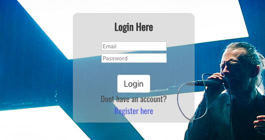

# sei-project-4

General Assembly Project 4: Feeling Radiohead
==========================
1 week long personal project using React.js, Flask.py, Marshmallow and SQLAlchemy.

Theme
==========
Radiohead is an all-time favourite band for me and it was a lot of fun working on this project.

I wanted to create a index/show board that gives each song the detail it deserves: The lyric snippet gives an insight into the meaning/thought process behind the song, the review and music video are additional links that will open in a new tab and wouldn't stop the music, which plays immediately.

I seperated the songs into categories that better describe their style and mood. I explained more of this on the About page.

I picked background images that are relevant to the song. Such as older pictures of the band for their early albums and abstract paintings for their more erratic experimental outputs.

Controls
===========
Register and Log In to the App.

Filter songs.

Click on a song to go into the show page, where music will play and can be paused. various info for the song.

Flask.py
============
The models and controllers are seperated into: base, categories, songs, users and forumtopics. With varying usages of the RESTful routes, since forumtopics would require all the routes while songs slightly less. *Currently website forum not configured on frontend, as I didn't feel it necessary for the idea of the app, however it's good to keep it as reference for future*

Base Model handles the datetime entries for user log in, posts and comments.

User model and Auth controller handles the logging in. Using bcrypt to hash and validate the password input. Manages the tokens when logging in and validations.

POST requests for login and register.

Router keeps all the routes of the Backend in one place and so easier to manage.

Secure Route checks that the Authorization token is present, manages the JSON Web Token and assigns the correct error message according to error response.

The Seeds file contains all the creative content from user profiles, songs to categories that makes up the core content of the site. The database is dropped and re-created on every seed run.

React.js
============
Connecting RESTful path from the backend to the components, which manages the functions and requests on the page.

The filter Songs option is done almost entirely on React, using the category data from seeds, the Songs are filtered to show only the categories selected.

And on Render.

The Song component gets referenced directly into Songs and acts as a specific function outside of the component, where the design and references to the seeds file is managed.

In the Song Show component the data is laid out for presentation.

Auth handles the log in and authentication for the user. Giving a token that expires after a set time when the user log in. Removes the token while logging out.

App contains the BrowserRouter which easily manages the switching of different routes.

